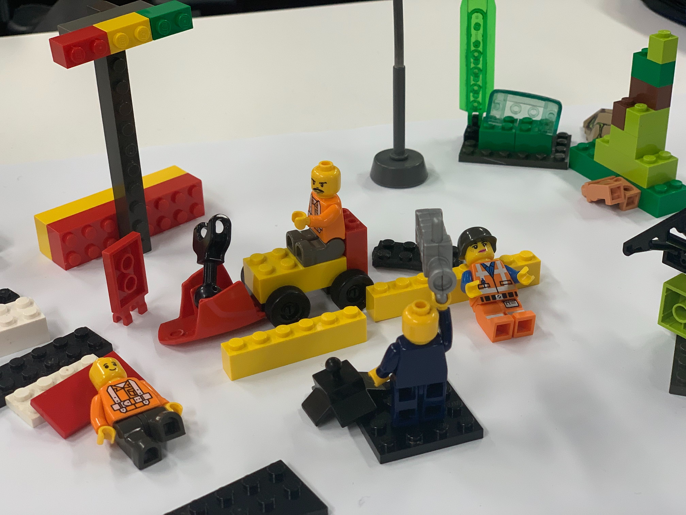
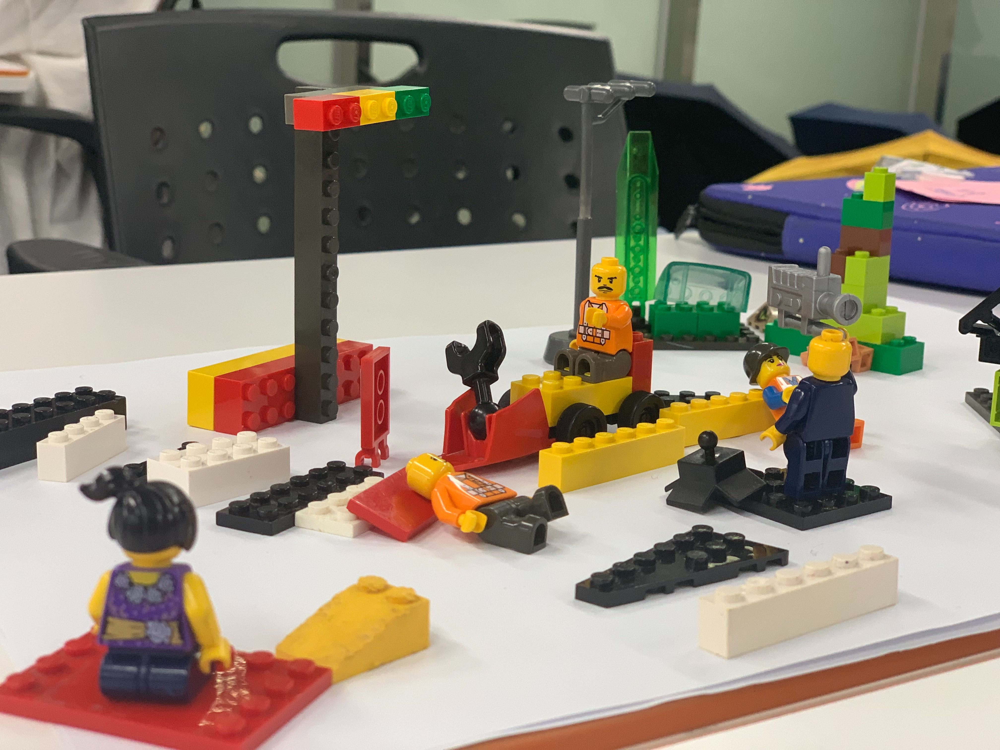
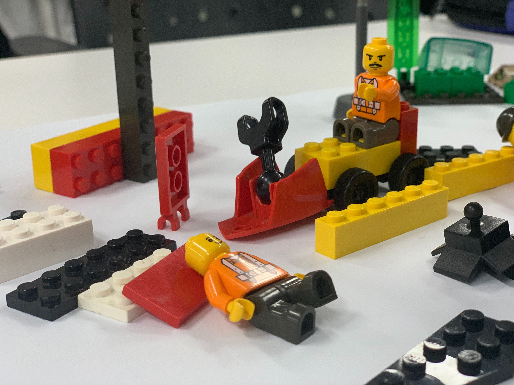

# [워크숍] 디자인씽킹

**#디자이너의 사고방식이란?**

1. 항상 시각화를 시도
2. 빠른 실패와 개선

**#디자인씽킹 프로세스 : 더블 다이아몬드**

☞ 비선형적이고 반복되는 과정을 거침.

1. 공감
2. 문제정의
3. 아이데이션 (문제를 해결하고자 하는 아이디어 발산과정)
4. 프로토타이핑 (문제해결 솔루션을 작성하는 과정)
5. 검증

**#인간 중심 디자인씽킹**

'솔루션'이 아닌 '인간'중심으로 올바른 질문 접근 (공감)

**#디자인씽킹이란? : 상대방의 사랑의 언어 찾기** 

ex> 5가지의 사랑의 언어

- 선물, 함께하는 시간, 스킨십, 칭찬의 말, 헌신적 행동

**#공감 성공사례 / 실패사례**

- 실패 : 모빌, 개도국아이의 얼굴이 그려진 음식물쓰레기통
- 성공 : 색각이상자 치하철 노선도, 노인 보행자 교통사고 막기위한 '장수의자'

#**인간중심에서 벗어난 편향적인 데이터** 

- 아마존의 인공지능 채용 프로젝트(여성배제)
- 인공지능 안면인식 기술(백인남성위주)

#**모든 개별 요소를 설명해주지 않는 데이터**

>> 극단적 사용자 인터뷰  

#**데이터의 약점을 보완해주는 디자인 씽킹**

→ 데이터를 통한 사회혁신 

- 데이터 엑티비즘 ex> 케냐의 우샤히디 프로젝트, 메르스 확산 지도, 소화전 입양하기

#**디자인씽킹의 약점을 보완하는 데이터** 

→ 정량적, 객관적 분석과 리소스 절약

 

**[실습]**

1. 대주제 선정 - 이슈 카테고리 & 대상 선정
    - 안전/노인
2. 소주제 탐색 - 대주제와 관련된 데이터 탐색을 통해 소주제 선정 
    - 고령운전자의 교통사고

    [자료]

    [https://www.police.go.kr/portal/main/contents.do?menuNo=200551](https://www.police.go.kr/portal/main/contents.do?menuNo=200551)

    [https://www.ktdb.go.kr/www/selectBbsNttView.do?key=42&bbsNo=7&nttNo=3175](https://www.ktdb.go.kr/www/selectBbsNttView.do?key=42&bbsNo=7&nttNo=3175)

    [http://taas.koroad.or.kr/sta/acs/exs/typical.do?menuId=WEB_KMP_OVT_UAS_ASA](http://taas.koroad.or.kr/sta/acs/exs/typical.do?menuId=WEB_KMP_OVT_UAS_ASA)

3. **대표 공감대상 설정하기**

    → persona

    → 왜, 필요한가? : 공급자 관점/사용자 관점

    

4. **시스템 씽킹**
    - 사회문제는 매우 복잡하며, 이를 인지하기 위해서는 문제를 만들어내는 상호 관계망을 이해하는 것이 매우 중요!
    - 선형성 / 복잡성
    - 현재 → 미래 (문제의 전체 시스템에 대해 파악할 수 있음)

    **[실습]**

    → '현재' 시스템 만들기 

    : 문제가 있는 현재의 시스템을 모형, 주변사물을 활용해 표현해봅시다

    - 문제를 겪는 당사자와 이해관계자
    - 각 주체(기관, 개인 등) 간의 관계
    - 해결 가능 자원 및 플레이어
    - 자원의 흐름

    

    

    

5. **최종 문제정의**

    → 문제 정의 문장 만들기

    >> 구체적 대상 : _____ 한 ______ 가 

    >> 최종목표 : __________ 하기 위해서는

    >> 정의한 문제: ____________________ 가 해결되어야 한다.

    > 고령운전자 노갑수씨가 안전한 운전을(가고싶은 곳을 원하는 시간에 가기) 하기 위해서는 <자기인지능력, 면허갱신 시스템, 도로표지판 글자크기, 교통약자의 환경>(이)가 해결되어야 한다.

        1. 구체적 대상 : 문제 해결에 있어 주요 이해관계를 가지고 있는 대상을 생각해보는 것이 중요
        2. 최종목표 : 문제를 해결해서 이루고자 하는 목표가 무엇인지 확실히 하는 것이 필요
        3. 정의한 문제 : 최종적으로 문제의 핵심이라고 생각하는 내용, 원인 적어보기