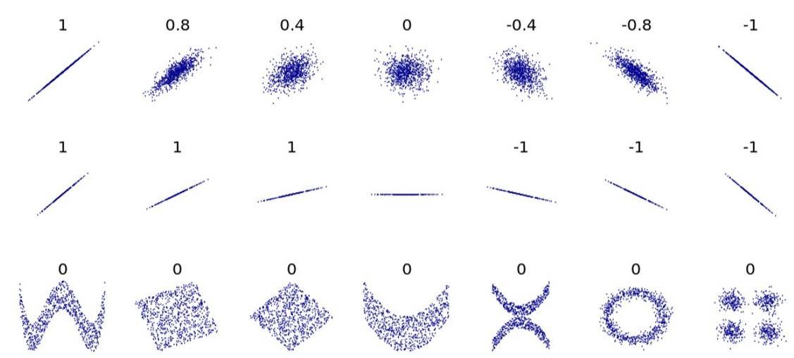

# 7강

강의명: 회귀분석
일자: Sep 16, 2019
주제: 예측

목차

- 예측
    - 회귀분석
    - 회귀의 다양한 문제들
- 잠재
    - 클러스터링
    - 요인분석과 차원축소
- 시간
    - 시계열분석과 생존 분석
    - 마케팅 효과

---

### 회귀분석

**#상관 Correlation**

⇒ 두 변수가 서로 관련이 있음을 나타내는 것

- 산점도 scatterplot
    - 두 연속 변수의 관계를 시각화
    - 한 건의 데이터를 점으로 표시

    <ex> 커피가 비쌀 수록 맛있는가? x = 가격, y = 맛

    ** 두 변수사의 관계를 눈으로 볼 수 있기 때문에 사용

- 공분산 covariance
    - 함께 퍼지는 정도
    - 두 연속 변수의 관계를 수치화
    - 두 변수가 같은 방향으로 변하면 + , 반대 방향으로 변하면 -
    - 함께 변하는 경향이 강할 수록 절대적 크기가 커짐

- 상관계수 cprrelation coefficeient
    - 항상 -1 ~ +1 범위

        **+1 : 완벽하게 같은 방향으로 움직임
        0 : 아무 관계없음
        -1 : 완벽하게 반대 방향으로 움직임**

        

        → U자형 경우는 

    - 허위 상관관계 spurious correlation
        - 데이터가 작을 경우는 어떻게든 상관계수가 나오게 됨
        - 두 변수 사이에 실제로는 관계가 없어도 상관관계가 나타나는 경우

            <ex> 바이블 코드 

        - 상관계수의 신뢰구간을 확인

            ** 신뢰수준을 높이면 신뢰구간이 더 넓어짐

    - 여러 가지 상관계수
        - 피어슨 상관계수 : 보통 상관계수를 말할 때 사용

             ⇒ 원 데이터를 가지고 상관관계를 구하는 것

        - 스피어만 상관계수
        - 켄달 상관계수

            ⇒ 데이터의 서열을 가지고 상관관계를 구하는 것

            ⇒ 데이터 자체가 등수의 상관관계를 가지거나, 비선형적일 때 사용함

        1. 부트스트래핑으로 신뢰구간 직접구하기
        2. P 값이 0.05 ↓

**#회귀분석 Regression**

- 여러 가지 의미로 사용
    - 넓은 의미 : X → Y 예측
    - 중간 의미 : Y가 연속인 경우
    - 좁은 의미 : 선형 회귀 분석
- 회귀는 '돌아간다'라는 뜻

- 절편과 계수
    - 절편(intercept) : 독립변수가 모두 0일 때 종속변수의 값

        <ex> Y (가격) = aX(평수) + b

    - 계수(coefficient) : 독립변수가 1증가 할 때 종속변수의 변화

    ** 보통 절편의 신뢰구간을 잘 보지 않음

- 계수의 신뢰구간
    - 표준오차(standard error) : 표본 분포에서 표준 편차
    - t : 회귀계수/ 표준오차
    - p :

    coef 계수  std err(이론 *2) t (이론) P>|t| (작을수록 좋음)

    모형 - 적합도 지수 

    R-squared = 에타제곱 (분산 %) 

    Adj.R-squared : 독립변수가 많아질 때 R^2 이 늘어나는 것을 막아줌

    회귀분석에서 독립변수가 하나만 존재할 경우는 상관계수를 제곱하면 R^2가 됨

- R^2
    - 종속변수의 분산 중 회귀분석에 의해 설명되는 비율

- F-통계량
    - 절편을 제외한 모든 회귀계수가 0일 때를 가정하고 계산한 수치
    - Prob(F) 를 P값과 비슷하게 해석함

1. 독립변수의 계수를 봄
2. 신뢰구간을 봄
3. + → + / - → - 등 부호가 변화하지 않아야 함
4. Prob(F) < 0.05
5. **모형 비교 수정결정계수 ↑ , AIC ↓, BIC ↓ (결정계수는 비교할 때 사용하지 않음)**

### 통계 VS 머신러닝

① 모형선택 여부 : O / O

② 변수 해석 여부 : O / X

→ 통계는 예측 왜???? 

→ 머신러닝은 예측 잘하면 ok

**#변수선택**

- 하나의 종속변수에 영향을 주는 독립변수들 사이에는 관련이 존재
- 변수들이 많을 때 가능한 독립변수의 조합이 다양
    - 단계적 회귀분석 Stepwise Regression

        ⇒ 변수를 단계적으로 추가/삭제하는 방법

        → 데이터가 적고 변수가 적다면 쓸수 있음

        → 과거에는 많이 사용했으나 지금은 잘 사용하지 않음

        1. 전방 선택 Forward Selection 
            - 절편만 있는 모형으로 시작
            - 추가했을 때 모형을 가장 많이 개선할 수 있는 변수를 추가

        2. 후방 선택 Backward Selection
            - 모든 변수를 투입한 모형으로 시작
            - 제외했을 때 모형을 가장 많이 개선하는 변수를 제외
            - 지나치게 많은 변수를 포함시킬 위험이 존재

    ### <복습테스트>

    - MSE에 대한 설명으로 올바른 것을 **모두** 골라 보세요.

            #해설
            절댓값이 제곱대신 사용되기 때문에 MAE가 된다.
            파라미터를 추정할 때는 MSE가 가장 작게 만드는 파라미터를 찾는다(오차이기때문에 작을 수록 좋음?)
            선형 모형에서 MSE를 가장 작게 만드는 파라미터는 항상 하나가 존재한다.

    - 베게에 따라 수면시간이 달라지는지 알아보는 실험을 했다. 이 실험에서 에타제곱이 0.8이면 분산의 몇 %가 베게(집단 간 차이)로 설명되는 것인가?  `<80%>`

            #해설
            0.8이므로 분산의 80%가 베게(집단 간차이)를 설명

    - 위의 실험에서 구형 베게 대비 신청 베게의 효과 크기가 코헨의 d로 0.5였다. 만약 수면 시간의 표준편차가 2시간이라면, 신형 베게를 벤 사람들이 구형베게를 벤 사람들보다 평균적으로 얼마나 더 자는 것인가? `<1시간>`

            #해설
            코헨's D는 0.5*2를 해줘야 함

    - 탐색과 활용 문제에 대한 설명으로 옳은 것을 **모두** 골라 보세요.

            #해설
            무조건 활용을 많이 하는 것은 탐색을 하지 않기 때문에 개선이 되지 않음 

    - 홈페이지 디자인의 A안과 B안 중에 고민을 하고 있습니다. 이를 MAB 문제로 다룰 때, 아래 설명 중 올바른 것을 **모두** 골라 보세요.

            #해설
            행동이라는 것은 A를 하든 B를 하든 모든 것을 말함
            보상은 어떤 행동에 대한 결과라고 볼 수 있음
            가치는 평균적인 보상을 의미함
            입실로 그리디는 가끔 입실로 만큼 탐색을 하고 나머지는 활용하는 것 
            입실론 그리디 전략에서 지수이동평균은 최근 데이터를 더 평균에 반영을 하기 때문에 그에 따라 트렌드에 맞게 할 수 있음