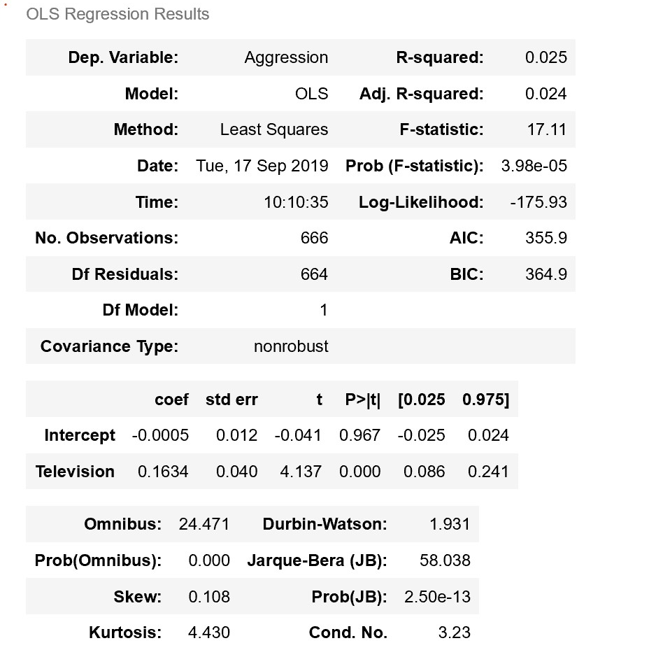
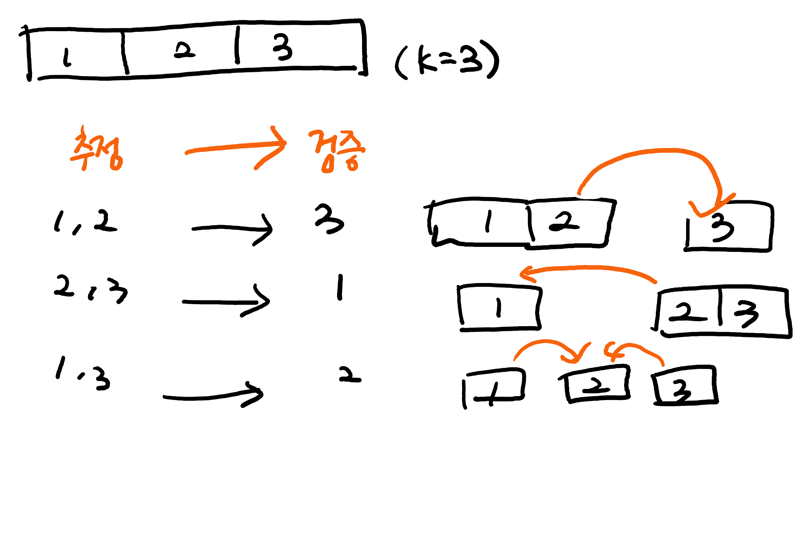
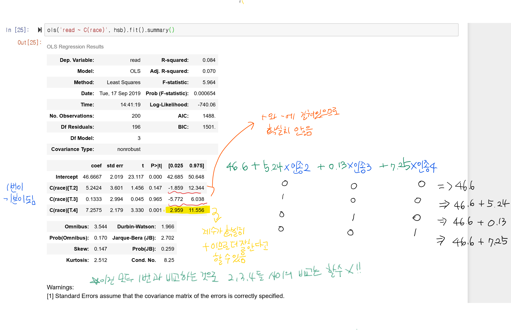
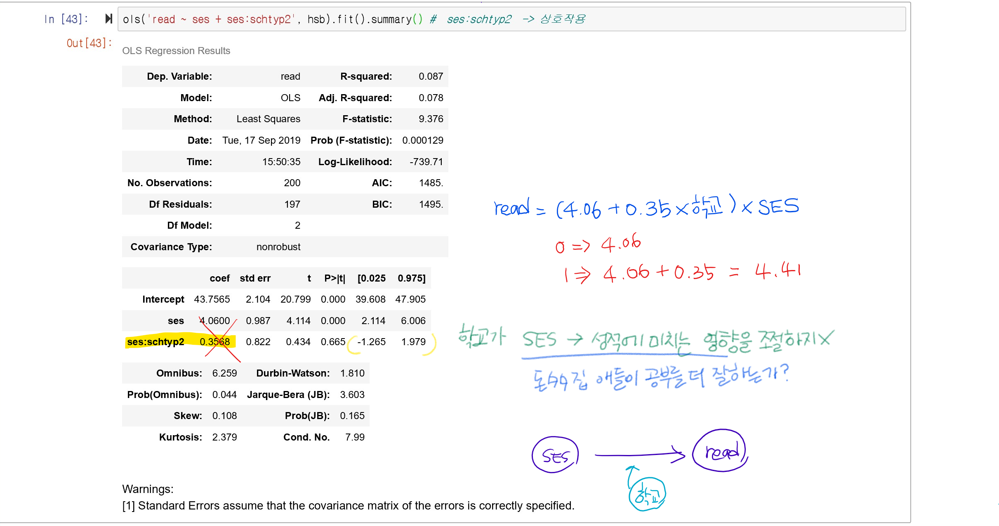
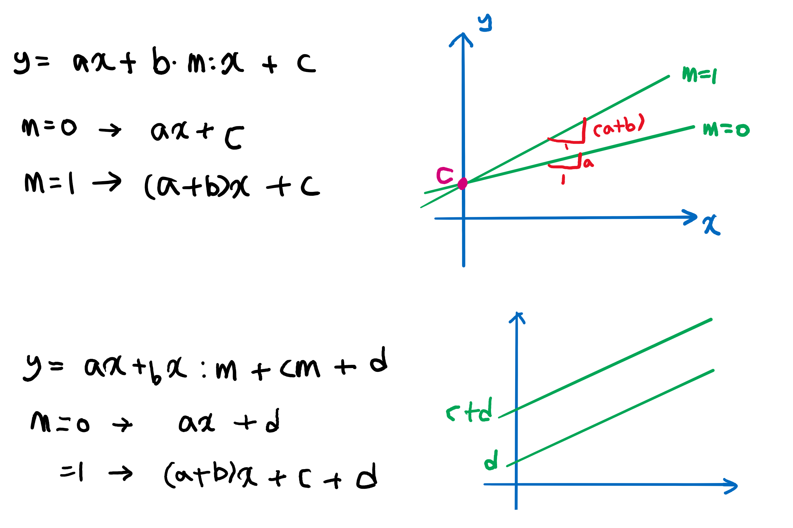

# 8강

강의명: 회귀분석 고급
일자: Sep 17, 2019
주제: 예측

### [오전수업]

- **잔차의 해석**

    

    - 잔차 Residual

        ⇒ 회귀 분석의 예측과 실제값의 차이

        ⇒ 잔차의 분포에서 주목하는 특성들 (왜도, 첨도, 등분산성)

        1. 왜도 → 분포의 비대칭성 ~~(한쪽 꼬리가 긴 모양)~~
        2. 첨도 → 분포가 한 점에 몰린 정도 
                → 정규분포의 첨도 = 3 
                → 첨도가 높음(데이터가 중심에 몰려 있음) / 첨도가 낮음(데이터가 바깥으로 퍼져 있음) 

    - 잔차의 정규성 normality

        ⇒ 잔차가 정규분포에 가까운 성질을 가지고 있는가?

        ⇒ Omnibus / Jarque-Bera(JB) : **둘 다 Prob가 1에 가까울 수록 정규분포에 가까움**

    - 등분산성 homoscedasticity

        ⇒  모든범위에서 잔차의 분산이 같음 

        (즉, 어떤 x에서든 비슷한 정도의 y를 맞출 수 있음)

        ⇒ Dubin-Watson 통계량이 1~2 정도

    - 조건수 condition number

        ⇒ 입력의 변화에 따른 출력의 변화를 나타내는 수  (입력에 민감함!!)

        ⇒ 조건수가 ↑ (데이터가 조금만 달라져도 결과 -추정계수- 에 큰 차이)

        ⇒ 통상적으로 30 이하

        ※ 다중 공선성 Multicolinearity

        ⇒ 여러가지가 함께 직선을 만듦?

        ⇒ 독립변수들이 서로서로 예측가능할 경우

        ** 조건수가 커짐

        ⇒ 데이터나 변수의 변화에 따라 추정된 계수가 크게 달라짐

        다중공선성(독립변수끼리 예측이 가능)은 계수 추정이 불안정하게 되고, 이를 나타내는 지표는 조건수로 조건수가 높은 경우이다.
        이럴 경우, 다중공선성이 높은 변수를 빼주어야 함!!

- **변수선택**
    - 교차 검증 Cross Validaiton

        ⇒ 데이터를 무작위로 두 세트로 나눔

        ⇒ 한 세트에서 추정 / 다른 세트에서 검증 (잘/ 잘) (잘 / 못 : 과적합)

        - K- fold 교차 검증

            ⇒ 데이터를 K개로 나누어 CV를 K번 하는 방법 

            

- **정규화 Regularization**

    ⇒ 가능한 계수를 작게 추정하는 방법 
         **[효과]** 과적합되지 않음

    - 과적합 overfitting : 모형의 계수가 주어진 데이터에 지나치게 의존하여 추정되는 경우

        ⇒ **①변수가 많을 수록, ②계수가 클 수록 과적합의 위험이 큼** 
            (계수가 작다는 것은 기울기가 작다는것? : 그럴 경우 underfit 될 수 있음)

        ⇒ 만약 계수가 0 이라면 변수를 추가하지 않은 것과 같음

        과적합 되지 않게 하려면, 설명을 못하게 하면 됨!
        1. 변수 작게
        2. 계수 작게 ⇒ 정규화
        3. 곡선이 아닌 직선 형태로!

    - 회귀분석에서 정규화

        ⇒ 오차(MSE)를 최소화

        ⇒ (오차 + 계수)를 최소화 하도록 함

        ⇒ 오차가 조금 늘어나더라도 계수를 작게 만들어 과적합을 방지

        1. 라쏘 Lasso 

            오차를 제곱해서 합한 것들을 전체 개수로 나눈 MSE +  λ 곱하기 |ω|의 합

            - λ : 클 수록 계수를 최소화하는 데 더 큰 비중을 줌
            - 회귀계수를 0 으로 만드는 경향 ⇒ 변수 선택

            ** 오차 뿐만 아니라 계수를 최소화 함

        2. 릿지 Ridge (딥러닝에서는 가중치 감쇠Weight decay라고 함)

            라쏘와 비슷하지만 절댓값이 아닌 제곱을 해주는 것

            ⇒ 릿지는 회귀계수가 0이 되지는 않아서 다른 데이터에서 일반화 되는 경향이 있음

        - 엘라스틱 넷 Elastic Net

            ⇒ 라쏘 + 릿지

        - 하이퍼파라미터 hyperparameter

            : 모형의 특성을 결정하지만, 데이터로부터 학습되지 않는 값

            ⇒ 엘라스틱 넷에서 λ와 a

            ⇒ CV를 통해 결정

### [오후 수업]

목차

- 더미코딩
- 상호작용
- 로지스틱 회귀분석
- 혼돈행렬
- 최근접 이웃
- 의사결정나무
- 앙상블

---

- **더미코딩 Dummy Coding**

    ⇒ 독립변수에 이산형(범주형) 변수가 있을 경우 

    <ex> 짜장, 짬뽕, 볶음밥

    다중공선성 (독립변수가 예측이 되기 때문에 3개가 아닌 2개만 만드는 것 )

    - 더미 코딩의 해석

        

- **상호작용 Interaction**

    ⇒ 두 독립변수의 곱으로 이뤄진 항(xm)

    y = x + m + xm (여기서  m은 0, 1)

    1. 상호작용이 없는 경우 →  y = x + m (m에 따라 x의 절편이 달라지는 것)
    2. 상호작용이 있는 경우 

    

    

### [복습테스트]

- 다음 각 문제를 분석하려고 할 때, "선형 모형"과 "로지스틱 선형 모형" 중 더 적절한 **모형**을 고르세요.

        로지스틱은 Y가 이거냐 저거냐로 두가지 중 하나인 것! 그리고 여부를 파악할 경우 대다수 로지스틱

- 두 집단이 다르다고 결론을 내리려면, 실험을 통해 관찰된 두 집단의 차이가 부트스트래핑을 통해 알아낸 신뢰구간의  `<범위 밖으로 벗어나야 한다>`

        #해설
        오차범위 안에 있으면 차이가 난다고 할 수 없으므로 벗어나야 차이가 난다고 생각하는 것과 비슷한 개념

- 상관계수에 대한 설명으로 올바른 것을 **모두** 골라보세요.

        #해설
        두 변수가 얼마나 관련이 있는지 나타낸다
        -1에서 1까지 범위를 가진다
        한 변수가 증가할 때 다른 변수도 증가하면 +가 된다
        한 변수가 증가할 때 다른 변수는 감소하면 -가 된다
        서열의 상관을 구할 때는 스피어만 상관계수나 켄달 상관계수를 사용한다
        
        *[주의] U자형의 비선형적인 관계도 나타낼 수 있다
         > 눈으로 보면 관계가 있어보이지만 상관계수로는 검출 되지 않음

- 선형 회귀분석을 실시한 결과 R제곱(R-squared)가 0.8이 나왔습니다. 분석 모형은 종속변수의 분산의 몇 %를 설명합니까? `<80%>`

        #해설
        R-squared와 에타제곱은 같은 것으로 볼 수 있음

- 다음 중 선형 회귀분석의 모형을 비교할 때 사용하는 적합도 지수를 **모두** 고르세요 `<Adg.R-squared, AIC, BIC>`

        #해설
        R-squared / Log-Likelihood 는 독립변수의 수가 많아지면 좋아지는 경향(과적합?)을 보여주므로 모형을 비교할 때는 사용하지 않음
        

- 선형 회귀분석에서 회귀계수의 신뢰구간은 어떠해야 합니까? `<플러스든 마이너스든 어느 한쪽에만 있어야 한다>`