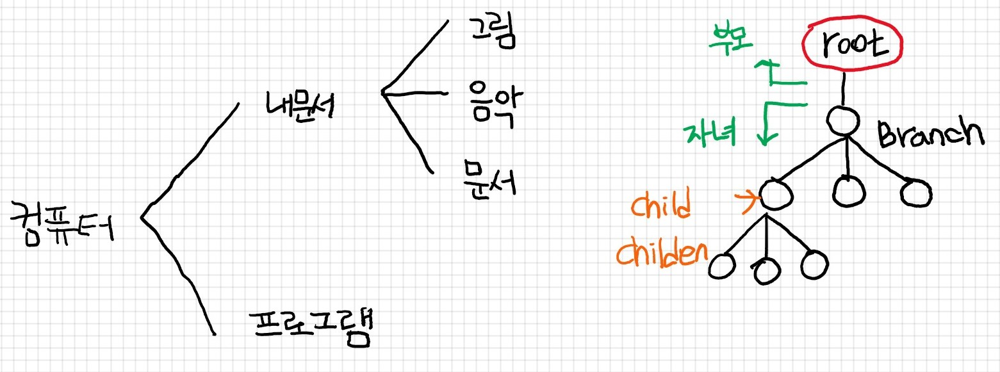

# 강의노트

날짜 :  2019년 09월 24일

강사 :  아샬님

---

### 체크인

 ☞ 오늘은 어때?

- 6점
- 오늘은 일찍일어나서 상쾌함

---

### 오늘의 목표

1. API 사용 익숙해지기
    - 트리 정복
2. 데이터 시각화 익숙해지기

---

### - 트리(Tree)

- 부모 - 자녀 관계로 데이터 관리를 용이하게 한 구조
- 폴더를 기반으로 한 파일 시스템이 대표적

    

    → xml은 한 번 가공을 해줘야 tree 형태가 되는 것 (그 작업을 파싱이라고 하는 것!!)

### - LocationIQ API 사용

LocationIQ - Free & Fast Geocoding and Reverse Geocoding service

[https://locationiq.com/](https://locationiq.com/)

API 문서

[https://locationiq.com/docs](https://locationiq.com/docs)

→ “Search / Forward Geocoding” 섹션의 “Python” 탭을 보시면 됩니다.

Jupyter Notebook

[https://nbviewer.jupyter.org/github/ahastudio/CodingLife/blob/master/20190919/python/03-locationiq.ipynb](https://nbviewer.jupyter.org/github/ahastudio/CodingLife/blob/master/20190919/python/03-locationiq.ipynb)

[190924_03-locationiq.ipynb](190924_03-locationiq.ipynb)

[190924_04-integration.ipynb](190924_04-integration.ipynb)

---

### 회고

기분점수 : 4점

경험 : 음,,, 알듯말듯 모르겠는 상태라서 급 우울

느낌 : 계속 하다보니 대략적으로 알 것 같은 느낌이지만 또 모르겠음

배운 것 : pandas에서 api를 사용하는 법을 자세하게 배움

계획 : 집에가서 아샬님 코드를 꼼꼼히 돌려봐야 겠음.